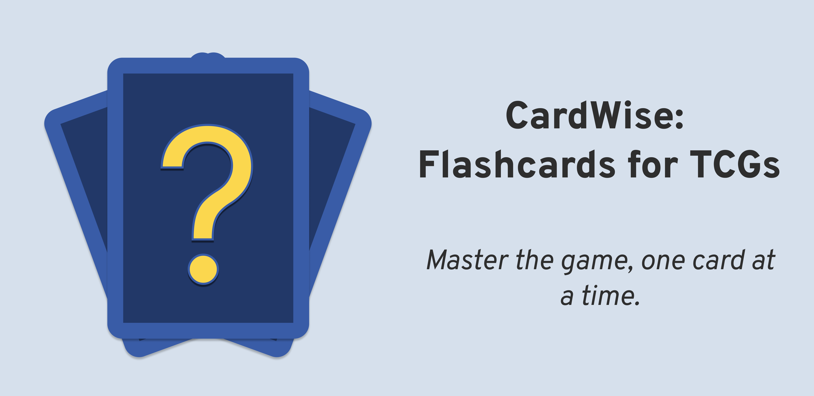

# CardWise

Dive into the world of Trading Card Games like never before! CardWise is your ultimate digital companion, transforming the way you learn and master your favorite TCGs.

> Project is done as an assignment for the [CITB558 Web programming with HTML and JS](https://ecatalog.nbu.bg/default.asp?V_Year=2023&YSem=3&Spec_ID=&Mod_ID=&PageShow=coursepresent&P_Menu=courses_part1&Fac_ID=3&M_PHD=0&P_ID=832&TabIndex=1&K_ID=42289&K_TypeID=10&l=1) course at [NBU](https://nbu.bg).

## Supported TCGs
- [**Disney Lorcana**](https://www.disneylorcana.com/en-US) (_completed_)
- [**Pokemon TCG**](https://www.pokemon.com/us/pokemon-tcg) (_in progress_)
- [**Star Wars: Unlimited**](http://unlimitedffg.com) (_planned_)

## Features

- Focus on specific parts of the cards you want to learn
- Load decks from [Dreamborn.ink](https://dreamborn.ink), [Pokemoncard.io](https://pokemoncard.io/deckbuilder/), [Pokemon TCG Live](https://tcg.pokemon.com/en-us/tcgl/), etc
- Progress Tracking

## Acknowledgements
This project would not exist if it's not for the following people & resources:
- [Lorcana API](http://lorcana-api.com)
- [TCG Dex](https://tcgdex.dev)
- [SWU-DB API](https://www.swu-db.com/api)

## Contributing

Contributions are always welcome! There's no defined way of how a contribution should be done right now.
